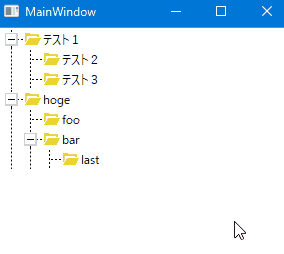

WPF TreeView Customized2
=====================================================================

WPF TreeView の見た目をカスタマイズしてみたものです.  

* 親子兄弟の関係が破線付きで描画
* 昔ながらの ＋/- による開閉ボタン
* Explorer のような行で選択が可能

このあたりを実現させるために作成しました。  
現在の課題は、末尾の兄弟・子よりも先まで破線が描画されてしまうことです。

